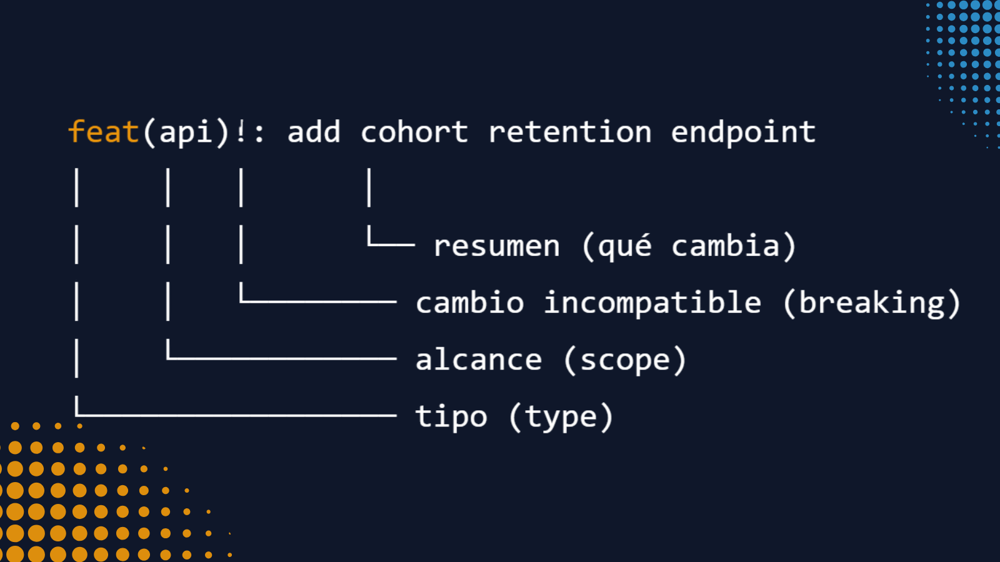
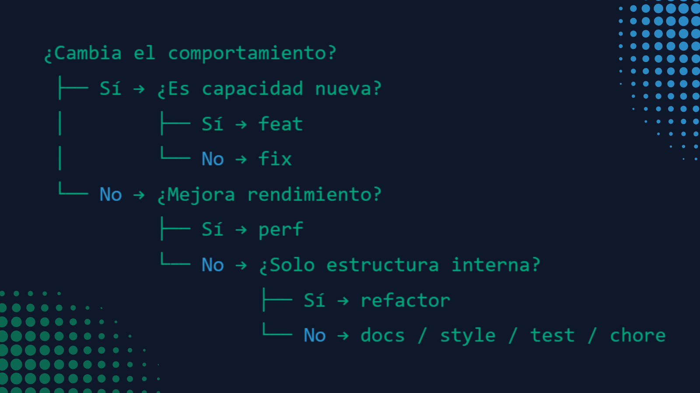
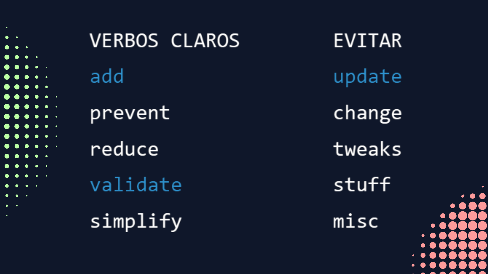
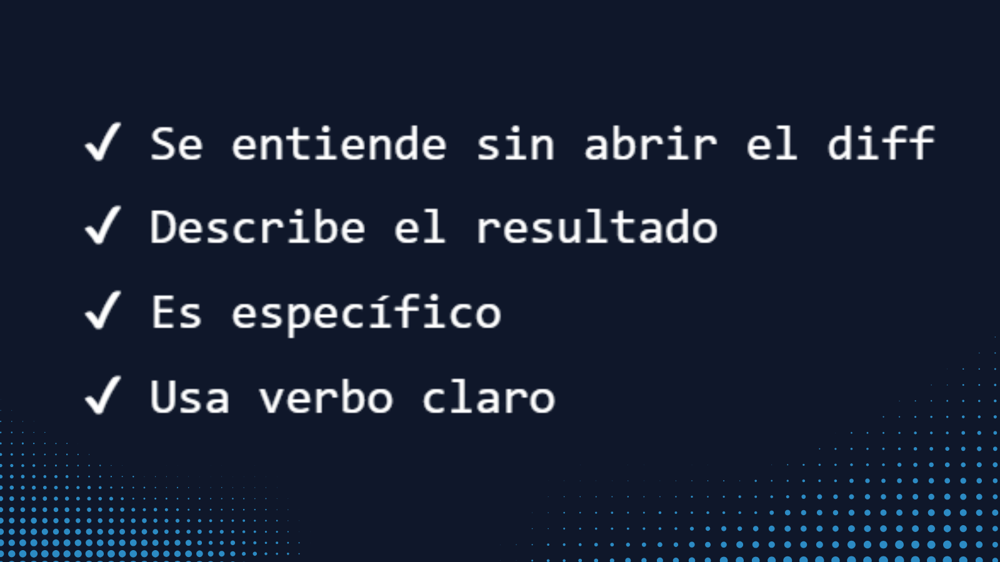

<!-- README.es.md -->

🌍 English version: [README.md](README.md)

<h1>Conventional Commits — guía práctica y plantilla reproducible (2026)</h1>

<strong>Practical guide + templates de Conventional Commits para equipos y proyectos reales</strong> 
Guía clara, aplicable y sin fricción para usar Conventional Commits con mapeo a SemVer.

Research actualizado: 02/2026 · Basado en la especificación Conventional Commits v1.0.0

 

<nav aria-label="Navegación rápida">
<a href="#por-qué-esta-guía-existe">Por qué</a> ·
<a href="#regla-base-en-20-segundos">Regla base</a> ·
<a href="#cheat-sheet-de-tipos">Cheat sheet</a> ·
<a href="#cómo-escribir-buenas-descripciones-de-commit">Descripciones</a> ·
<a href="#plantillas-reutilizables">Plantillas</a> ·
<a href="#semver-sin-misterio">SemVer</a> ·
<a href="#uso-en-equipos">Equipos</a>
</nav>

  

<main role="main">

<section id="por-qué-esta-guía-existe" aria-labelledby="por-que-heading">

<h2 id="por-que-heading">Por qué esta guía existe</h2>

  Soy <strong>Data Analyst Junior</strong> y estoy formándome en mi bootcamp con Factoría F5. 
  Trabajando en proyectos académicos y técnicos vi un patrón: el problema no suele ser el código… es la <strong>historia de cambios mal contada</strong>.

  <table role="table" aria-describedby="tabla-problemas">
    <thead>
      <tr>
        <th scope="col">❓</th>
        <th scope="col">🐢</th>
        <th scope="col">🧩</th>
        <th scope="col">😬</th>
      </tr>
    </thead>
    <tbody>
      <tr>
        <td><strong>Commits confusos</strong></td>
        <td><strong>Revisiones lentas</strong></td>
        <td><strong>Bugs difíciles de rastrear</strong></td>
        <td><strong>Releases con miedo</strong></td>
      </tr>
    </tbody>
  </table>

  Así que hice un research actualizado sobre <strong>Conventional Commits</strong> y lo trabajé usando uno de los métodos de aprendizaje que aplicamos en el bootcamp:
  explicar lo complejo en simple para comprobar que realmente está entendido.

  Lo desarrollé aplicando el método Feynman (<em>aprender → explicar → simplificar → reutilizar</em>) para convertir el conocimiento en práctica clara.
  Y convertí ese proceso en una guía práctica y reutilizable. No solo para estudiarlo, sino para poder aplicarlo en proyectos reales y compartirlo con equipos.

<blockquote>
  
Si cualquiera puede entender tus commits en segundos, tu proyecto escala mejor.

</blockquote>

<em>Documentar bien es también una forma de pensar mejor.</em>

Este README está pensado para:

<ul>
<li>personas que trabajan con Git en proyectos reales</li>
<li>estudiantes y perfiles junior que quieren una convención clara</li>
<li>equipos que quieren reducir fricción en revisiones y releases</li>
<li>repositorios que buscan commits consistentes y automatizables</li>
</ul>

</section>

<section aria-labelledby="que-es-heading">

<h2 id="que-es-heading">Qué es Conventional Commits</h2>

Conventional Commits es una convención para escribir mensajes de commit con estructura clara.

Permite:

<ul>
<li>changelogs automáticos</li>
<li>versionado SemVer consistente</li>
<li>clasificación de cambios</li>
<li>automatización de releases</li>
<li>mejor revisión de PRs</li>
<li>menos fricción en equipo</li>
</ul>

</section>

<section id="regla-base-en-20-segundos" aria-labelledby="regla-heading">

<h2 id="regla-heading">Regla base en 20 segundos</h2>

<strong>Formato:</strong>

<pre><code>type(scope)!: mensaje claro en imperativo
</code></pre>

<strong>Significa:</strong>

<ul>
<li><strong>type</strong> → tipo de cambio (feat, fix, docs…)</li>
<li><strong>scope</strong> → zona afectada (opcional)</li>
<li><strong>!</strong> → breaking change</li>
<li><strong>mensaje</strong> → qué cambia y para qué</li>
</ul>

<strong>Ejemplo:</strong>

<pre><code>feat(etl): add incremental load for customers
</code></pre>

<strong>Anatomía de un commit</strong>

Desglose visual de cada parte del mensaje de commit.

</section>

<section id="cheat-sheet-de-tipos" aria-labelledby="types-heading">

<h2 id="types-heading">Cheat sheet de tipos</h2>

Set más compatible con tooling y equipos.

<table role="table" aria-label="Cheat sheet de tipos de commit">
<thead>
<tr>
<th scope="col">type</th>
<th scope="col">Cuándo usarlo</th>
<th scope="col">Ejemplo</th>
</tr>
</thead>
<tbody>

<tr><th scope="row"><code>feat</code></th><td>Nueva funcionalidad</td><td><code>feat(api): add export endpoint</code></td></tr>
<tr><th scope="row"><code>fix</code></th><td>Corrección de bug</td><td><code>fix(ui): prevent modal overflow</code></td></tr>
<tr><th scope="row"><code>perf</code></th><td>Mejora de rendimiento</td><td><code>perf(sql): optimize join strategy</code></td></tr>
<tr><th scope="row"><code>refactor</code></th><td>Cambio interno sin alterar comportamiento</td><td><code>refactor(model): split pipeline</code></td></tr>
<tr><th scope="row"><code>docs</code></th><td>Documentación</td><td><code>docs: add data dictionary</code></td></tr>
<tr><th scope="row"><code>test</code></th><td>Tests</td><td><code>test(api): add edge cases</code></td></tr>
<tr><th scope="row"><code>style</code></th><td>Formato / lint</td><td><code>style: apply formatter</code></td></tr>
<tr><th scope="row"><code>build</code></th><td>Dependencias / build</td><td><code>build: bump numpy</code></td></tr>
<tr><th scope="row"><code>ci</code></th><td>CI/CD</td><td><code>ci: add pipeline cache</code></td></tr>
<tr><th scope="row"><code>chore</code></th><td>Mantenimiento general</td><td><code>chore: update gitignore</code></td></tr>
<tr><th scope="row"><code>revert</code></th><td>Reversión</td><td><code>revert: feat(api): export endpoint</code></td></tr>

</tbody>
</table>

<strong>Cómo elegir el tipo de commit</strong>

Ruta rápida para elegir el type correcto sin dudas.

</section>

<section id="cómo-escribir-buenas-descripciones-de-commit" aria-labelledby="desc-heading">

<h2 id="desc-heading">Cómo escribir buenas descripciones de commits</h2>

Un buen commit debería entenderse sin abrir el diff.

<blockquote>

diff = vista de diferencias línea a línea que muestra qué código cambió exactamente.

</blockquote>

Sirve para:

<ul>
<li>tu yo futuro</li>
<li>quien revisa tu PR</li>
<li>quien entra nuevo al proyecto</li>
<li>herramientas de changelog</li>
</ul>

<blockquote>

Regla clave: <strong>qué cambia + para qué cambia</strong>

</blockquote>

No describas el archivo. Describe el resultado.

<h3>Método práctico</h3>

Piensa primero en español → escribe luego en inglés si tu repo lo usa.

<strong>Fórmula:</strong>

<pre><code>verbo + objeto + contexto mínimo
</code></pre>

Ejemplo mental: 
“evitar duplicados en reintentos del ETL”

Commit final:

<pre><code>fix(etl): prevent duplicate rows on retry
</code></pre>

<h3>Verbos útiles (rápida referencia)</h3>

add · fix · prevent · improve · reduce · support · validate · simplify · split · remove

Evita verbos vagos:

update · change · tweaks · stuff · misc

<strong>✍️ Verbos fuertes para mensajes de commit</strong>

Verbos claros hacen commits claros.

<h3>Ejemplos de commits claros</h3>

<pre><code>fix(api): handle null user_id in payload
feat(model): add churn probability feature
perf(sql): reduce join cost in revenue report
docs: add data dictionary for sales table
</code></pre>

<h3>Test rápido de calidad (10 segundos)</h3>

Si sí → commit sólido.

<strong>Checklist de calidad del commit</strong>

Auto-revisión rápida antes de hacer push.

<h3>Regla de oro para equipos</h3>

Mejor un commit <strong>simple y claro</strong> que perfecto pero ambiguo. 
La consistencia del equipo vale más que la creatividad individual.

</section>

<section id="plantillas-reutilizables" aria-labelledby="templates-heading">

<h2 id="templates-heading">Plantillas reutilizables</h2>

<h3>Commit simple</h3>

<pre><code>type(scope): verbo + objeto + contexto
</code></pre>

<h3>Commit con contexto</h3>

<pre><code>type(scope): cambio principal

Motivo: por qué era necesario
Impacto: qué mejora o evita
</code></pre>

</section>

<section aria-labelledby="breaking-heading">

<h2 id="breaking-heading">Breaking changes (muy importante!!)</h2>

Si rompe compatibilidad:

<pre><code>feat(api)!: rename customer_id to client_id

BREAKING CHANGE: field renamed in all responses
</code></pre>

Eso permite a las herramientas marcar versión mayor automáticamente.

</section>

<section id="semver-sin-misterio" aria-labelledby="semver-heading">

<h2 id="semver-heading">SemVer, sin complicarnos (prometido)</h2>

Si tus commits están bien escritos, SemVer casi se calcula solo. 
La magia de la consistencia.

Mapping típico:

<ul>
<li>MAJOR → <code>!</code> o BREAKING CHANGE</li>
<li>MINOR → feat</li>
<li>PATCH → fix / perf</li>
<li>sin release → docs, test, style, chore, ci…</li>
</ul>

Configurable por equipo.

</section>

<section id="uso-en-equipos" aria-labelledby="equipos-heading">

<h2 id="equipos-heading">Uso en equipos (reglas que evitan discusiones)</h2>

En 2026 el problema rara vez es “cómo escribir un commit”. 
El problema es el día a día: cambios que llegan rápido (y a veces con AI), contexto que se pierde, documentación que se queda atrás y tiempo que se va en preguntar lo mismo por tercera vez.

Cuando faltan señales claras, los equipos pagan el “impuesto de coordinación”: más revisiones, más onboarding lento, más dudas al release. 
La buena noticia: una convención pequeña (y constante) reduce muchísimo esa fricción.

<ul>
<li>No inventar <code>types</code> sin documentarlos (si no está en la guía del repo, no existe)</li>
<li>Elegir idioma y mantenerlo (se recomienda inglés en commits por compatibilidad con tooling y equipos internacionales)</li>
<li>Un commit = una intención (si estás contando dos historias, separa en dos commits)</li>
<li>Si dudas, describe el impacto (qué cambia + para qué cambia)</li>
<li>Consistencia &gt; perfección (la claridad del equipo gana a la brillantez individual)</li>
<li>Si usas asistentes, revisa el mensaje como si fueras la persona que hará el onboarding (claridad primero)</li>
</ul>

</section>

<section aria-labelledby="uso-guia-heading">

<h2 id="uso-guia-heading">Cómo usar esta guía en la práctica</h2>

Esta guía está diseñada para uso directo:

<ul>
<li>como referencia rápida mientras haces commits</li>
<li>como plantilla base de CONTRIBUTING.md</li>
<li>como estándar de equipo</li>
<li>como material de onboarding técnico</li>
<li>como recurso didáctico en clases y bootcamps</li>
</ul>

Puedes copiar, adaptar y reutilizar las plantillas según tu flujo de trabajo.

</section>

<section aria-labelledby="refs-heading">

<h2 id="refs-heading">Referencias</h2>

<ul>
<li>https://www.conventionalcommits.org/en/v1.0.0/</li>
<li>https://github.com/conventional-changelog/commitlint</li>
<li>https://github.com/semantic-release/commit-analyzer</li>
</ul>

</section>

<footer align="center" role="contentinfo">

<h2>Si esta guía te ahorra tiempo en tu día a día técnico, hazla circular</h2>

Dale ⭐, compártela o pásasela a la próxima persona que entre a tu equipo.

</footer>

</main>
