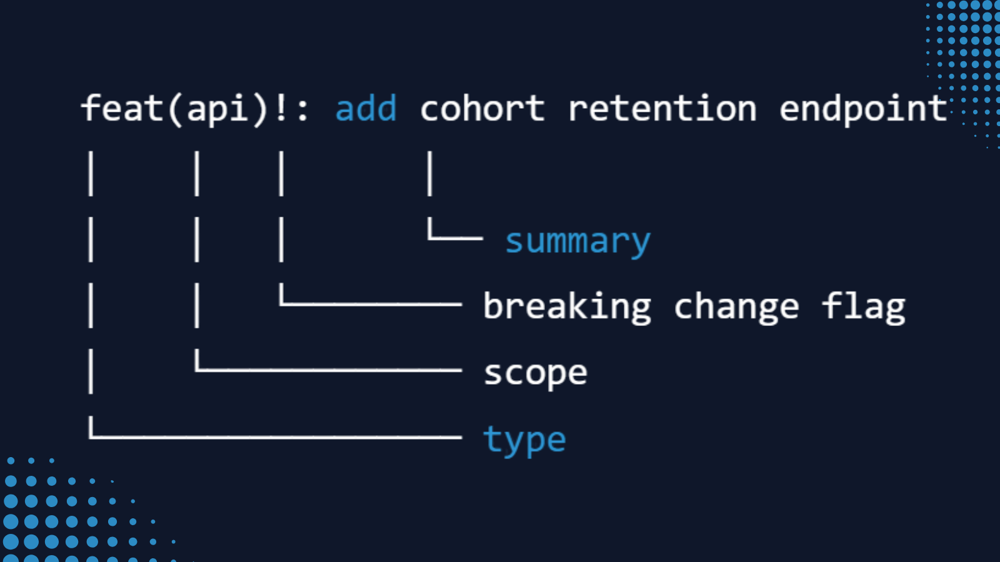
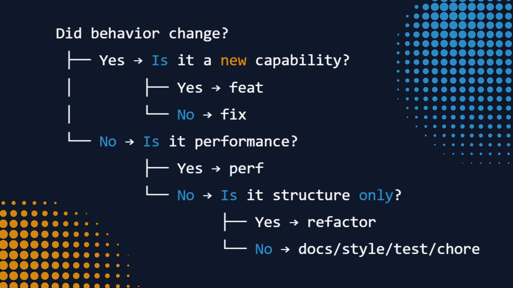
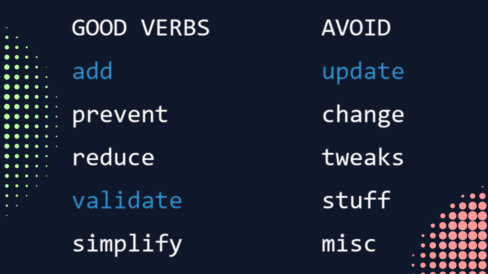
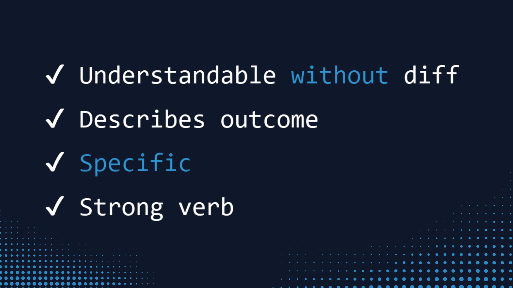

<!-- README.md -->

🌍 Spanish version: [README.es.md](README.es.md)

<h1>Conventional Commits — practical guide and reproducible template (2026)</h1>

<strong>Practical guide + Conventional Commits templates for real teams and real projects</strong> 
Clear, frictionless guidance for using Conventional Commits with SemVer mapping.

Updated research: 02/2026 · Based on the Conventional Commits v1.0.0 specification

 

<nav aria-label="Quick navigation">
<a href="#why-this-guide-exists">Why</a> ·
<a href="#the-20-second-rule">Base rule</a> ·
<a href="#commit-type-cheat-sheet">Cheat sheet</a> ·
<a href="#how-to-write-good-commit-descriptions">Descriptions</a> ·
<a href="#reusable-templates">Templates</a> ·
<a href="#semver-without-the-mystery">SemVer</a> ·
<a href="#team-usage">Teams</a>
</nav>

  

<main role="main">

<section id="why-this-guide-exists" aria-labelledby="why-heading">

<h2 id="why-heading">Why this guide exists</h2>

  I’m a <strong>Junior Data Analyst</strong> and I’m training in my bootcamp with Factoría F5. 
  Working on academic and technical projects, I noticed a pattern: the problem usually isn’t the code… it’s the <strong>change history being told poorly</strong>.

  <table role="table" aria-describedby="problems-table">
    <thead>
      <tr>
        <th scope="col">❓</th>
        <th scope="col">🐢</th>
        <th scope="col">🧩</th>
        <th scope="col">😬</th>
      </tr>
    </thead>
    <tbody>
      <tr>
        <td><strong>Confusing commits</strong></td>
        <td><strong>Slow reviews</strong></td>
        <td><strong>Hard-to-trace bugs</strong></td>
        <td><strong>Scary releases</strong></td>
      </tr>
    </tbody>
  </table>

  So I did updated research on <strong>Conventional Commits</strong> and worked through it using one of the learning methods we apply in the bootcamp:
  explaining complex things simply to verify they’re truly understood.

  I developed it by applying the Feynman method (<em>learn → explain → simplify → reuse</em>) to turn knowledge into clear practice.
  And I turned that process into a practical, reusable guide. Not just to study it, but to apply it in real projects and share it with teams.

<blockquote>
  
If anyone can understand your commits in seconds, your project scales better.

</blockquote>

<em>Good documentation is also a way to think better.</em>

This README is intended for:

<ul>
<li>people using Git in real projects</li>
<li>students and junior profiles who want a clear convention</li>
<li>teams that want to reduce friction in reviews and releases</li>
<li>repositories that want consistent, automatable commits</li>
</ul>

</section>

<section aria-labelledby="what-is-heading">

<h2 id="what-is-heading">What is Conventional Commits</h2>

Conventional Commits is a convention for writing commit messages with a clear structure.

It enables:

<ul>
<li>automatic changelogs</li>
<li>consistent SemVer versioning</li>
<li>change classification</li>
<li>release automation</li>
<li>better PR reviews</li>
<li>less team friction</li>
</ul>

</section>

<section id="the-20-second-rule" aria-labelledby="rule-heading">

<h2 id="rule-heading">The 20-second rule</h2>

<strong>Format:</strong>

<pre><code>type(scope)!: clear imperative message
</code></pre>

<strong>Meaning:</strong>

<ul>
<li><strong>type</strong> → kind of change (feat, fix, docs…)</li>
<li><strong>scope</strong> → affected area (optional)</li>
<li><strong>!</strong> → breaking change</li>
<li><strong>message</strong> → what changes and why</li>
</ul>

<strong>Example:</strong>

<pre><code>feat(etl): add incremental load for customers
</code></pre>

<strong>Commit anatomy</strong>

Visual breakdown of each part of a commit message.

</section>

<section id="commit-type-cheat-sheet" aria-labelledby="types-heading">

<h2 id="types-heading">Commit type cheat sheet</h2>

The most compatible set for tooling and teams.

<table role="table" aria-label="Commit type cheat sheet">
<thead>
<tr>
<th scope="col">type</th>
<th scope="col">When to use it</th>
<th scope="col">Example</th>
</tr>
</thead>
<tbody>

<tr><th scope="row"><code>feat</code></th><td>New functionality</td><td><code>feat(api): add export endpoint</code></td></tr>
<tr><th scope="row"><code>fix</code></th><td>Bug fix</td><td><code>fix(ui): prevent modal overflow</code></td></tr>
<tr><th scope="row"><code>perf</code></th><td>Performance improvement</td><td><code>perf(sql): optimize join strategy</code></td></tr>
<tr><th scope="row"><code>refactor</code></th><td>Internal change without behavior changes</td><td><code>refactor(model): split pipeline</code></td></tr>
<tr><th scope="row"><code>docs</code></th><td>Documentation</td><td><code>docs: add data dictionary</code></td></tr>
<tr><th scope="row"><code>test</code></th><td>Tests</td><td><code>test(api): add edge cases</code></td></tr>
<tr><th scope="row"><code>style</code></th><td>Formatting / lint</td><td><code>style: apply formatter</code></td></tr>
<tr><th scope="row"><code>build</code></th><td>Dependencies / build</td><td><code>build: bump numpy</code></td></tr>
<tr><th scope="row"><code>ci</code></th><td>CI/CD</td><td><code>ci: add pipeline cache</code></td></tr>
<tr><th scope="row"><code>chore</code></th><td>General maintenance</td><td><code>chore: update gitignore</code></td></tr>
<tr><th scope="row"><code>revert</code></th><td>Reversion</td><td><code>revert: feat(api): export endpoint</code></td></tr>

</tbody>
</table>

<strong>How to choose the right commit type</strong>

Fast path to choosing the right type with no doubts.

</section>

<section id="how-to-write-good-commit-descriptions" aria-labelledby="desc-heading">

<h2 id="desc-heading">How to write good commit descriptions</h2>

A good commit should be understandable without opening the diff.

<blockquote>

diff = a line-by-line view of changes showing exactly what code changed.

</blockquote>

It’s for:

<ul>
<li>future you</li>
<li>whoever reviews your PR</li>
<li>anyone new joining the project</li>
<li>changelog tooling</li>
</ul>

<blockquote>

Key rule: <strong>what changes + why it changes</strong>

</blockquote>

Don’t describe the file. Describe the outcome.

<h3>Practical method</h3>

Think in your clearest language first → then write in English if that’s what your repo uses.

<strong>Formula:</strong>

<pre><code>verb + object + minimal context
</code></pre>

Mental example: 
“avoid duplicates on ETL retries”

Final commit:

<pre><code>fix(etl): prevent duplicate rows on retry
</code></pre>

<h3>Useful verbs (quick reference)</h3>

add · fix · prevent · improve · reduce · support · validate · simplify · split · remove

Avoid vague verbs:

update · change · tweaks · stuff · misc

<strong>✍️ Strong verbs for commit messages</strong>

Clear verbs make clear commits.

<h3>Examples of clear commits</h3>

<pre><code>fix(api): handle null user_id in payload
feat(model): add churn probability feature
perf(sql): reduce join cost in revenue report
docs: add data dictionary for sales table
</code></pre>

<h3>Quick quality test (10 seconds)</h3>

If yes → solid commit.

<strong>Commit quality checklist</strong>

Fast self-review before pushing.

<h3>Golden rule for teams</h3>

Better a <strong>simple and clear</strong> commit than a perfect but ambiguous one. 
Team consistency matters more than individual creativity.

</section>

<section id="reusable-templates" aria-labelledby="templates-heading">

<h2 id="templates-heading">Reusable templates</h2>

<h3>Simple commit</h3>

<pre><code>type(scope): verb + object + context
</code></pre>

<h3>Commit with context</h3>

<pre><code>type(scope): main change

Reason: why it was necessary
Impact: what it improves or prevents
</code></pre>

</section>

<section aria-labelledby="breaking-heading">

<h2 id="breaking-heading">Breaking changes (very important!!)</h2>

If it breaks compatibility:

<pre><code>feat(api)!: rename customer_id to client_id

BREAKING CHANGE: field renamed in all responses
</code></pre>

This allows tools to automatically bump the major version.

</section>

<section id="semver-without-the-mystery" aria-labelledby="semver-heading">

<h2 id="semver-heading">SemVer, without the mystery (promise)</h2>

If your commits are well written, SemVer almost calculates itself. 
The magic of consistency.

Typical mapping:

<ul>
<li>MAJOR → <code>!</code> or BREAKING CHANGE</li>
<li>MINOR → feat</li>
<li>PATCH → fix / perf</li>
<li>no release → docs, test, style, chore, ci…</li>
</ul>

Configurable per team.

</section>

<section id="team-usage" aria-labelledby="teams-heading">

<h2 id="teams-heading">Team usage (rules that prevent debates)</h2>

In 2026, the problem is rarely “how to write a commit”. 
The problem is the day-to-day: changes arriving fast (and sometimes with AI), context getting lost, documentation falling behind, and time spent answering the same question for the third time.

When clear signals are missing, teams pay the “coordination tax”: more review cycles, slower onboarding, more uncertainty at release time. 
The good news: a small (and consistent) convention reduces that friction significantly.

<ul>
<li>Don’t invent <code>types</code> without documenting them (if it’s not in the repo’s guide, it doesn’t exist)</li>
<li>Pick a language and stick to it (English is recommended for commits due to tooling compatibility and international teams)</li>
<li>One commit = one intent (if you’re telling two stories, split into two commits)</li>
<li>If in doubt, describe the impact (what changes + why it changes)</li>
<li>Consistency &gt; perfection (team clarity beats individual brilliance)</li>
<li>If you use assistants, review the message as if you were the person doing onboarding (clarity first)</li>
</ul>

</section>

<section aria-labelledby="how-to-use-heading">

<h2 id="how-to-use-heading">How to use this guide in practice</h2>

This guide is designed for direct use:

<ul>
<li>as a quick reference while committing</li>
<li>as a base template for CONTRIBUTING.md</li>
<li>as a team standard</li>
<li>as technical onboarding material</li>
<li>as a teaching resource in classes and bootcamps</li>
</ul>

You can copy, adapt, and reuse the templates depending on your workflow.

</section>

<section aria-labelledby="refs-heading">

<h2 id="refs-heading">References</h2>

<ul>
<li>https://www.conventionalcommits.org/en/v1.0.0/</li>
<li>https://github.com/conventional-changelog/commitlint</li>
<li>https://github.com/semantic-release/commit-analyzer</li>
</ul>

</section>

<footer align="center" role="contentinfo">

<h2>If this guide saves you time in your day-to-day technical work, pass it on</h2>

Give it a ⭐, share it, or send it to the next person who joins your team.

</footer>

</main>
